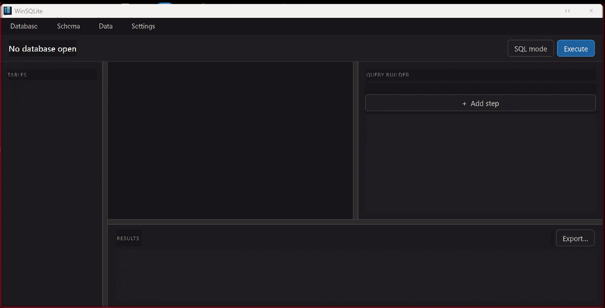

<div align="center">

WinSQLite Editor

A lightweight, lightning-fast, and native SQLite database browser built with C++ and Qt 6.

[](https://github.com/srdzank/SQLite-Editor/releases/latest)
[](https://apps.microsoft.com/detail/9NRD3HMXZW41)
[](https://github.com/srdzank/SQLite-Editor/releases)
[](LICENSE)
[](https://apps.microsoft.com/detail/9NRD3HMXZW41)

<br />

[**Download on Microsoft Store**](https://apps.microsoft.com/detail/9NRD3HMXZW41) • [**GitHub Releases**](https://github.com/srdzank/SQLite-Editor/releases) • [**Watch Demo**](#-video-demonstration) • [**Report Issue**](https://github.com/srdzank/SQLite-Editor/issues)

</div>


<div align="center">



*WinSQLite Editor in action: Instant startup, visual query building, and native execution.*

</div>
---

Overview

WinSQLite Editor is a high-performance, native desktop application designed for seamless SQLite database administration. Engineered with pure C++ and Qt 6, it delivers an ultra-responsive user experience with instant startup times, minimal memory consumption, and smooth handling of large database files without cloud dependencies or background tracking.

---

Download & Installation

Option 1: Microsoft Store (Recommended)
Get automatic silent background updates, easy one-click installation, and support the ongoing development of the project.

<a href="https://apps.microsoft.com/detail/9NRD3HMXZW41" target="_blank" rel="noopener noreferrer">
  
</a>

---

### Option 2: Direct Download (Portable)
Download the standalone `.zip` or `.7z` archive directly from our [GitHub Releases](https://github.com/srdzank/SQLite-Editor/releases) page, extract it anywhere, and run the executable. No administrative rights or installer required.

---

### Option 3: Windows Package Manager (Winget)
You can also install WinSQLite Editor directly from your command line:

```powershell
winget install WinSQLiteEditor
```

---

Edition Comparison

| Feature / Benefit | Microsoft Store | Portable Archive (.zip) |
| :--- | :---: | :---: |
| Full Core Functionality | ✅ | ✅ |
| 100% Offline & Privacy-First | ✅ | ✅ |
| Automatic Background Updates | ✅ | ❌ (Manual download) |
| One-Click Clean Install & Uninstall | ✅ | ❌ (Manual zip extraction) |
| Verified & Validated Security | ✅ (Store Checked) | ✅ |
| Support Independent Open-Source Dev | ❤️ Recommended | Optional |

---

Key Features

Database & Schema Management: Seamlessly open, inspect, and manage SQLite database schemas, tables, fields, triggers, and indices.
Smart SQL Editor: Built-in code editor equipped with syntax highlighting and context-aware autocomplete for rapid SQL drafting.
Ultra Fast & Native: Built natively with **C++** and **Qt 6** to ensure minimal resource overhead and lightning-fast query execution.
Visual Data Browser: View, inline-edit, search, and filter table records intuitively without writing manual `SELECT` queries.
Privacy-First & Lightweight: 100% offline-first utility with zero telemetry, zero trackers, and no bloatware.

---

Screenshots

| Schema & Table Browser | SQL Query & Results Execution |
| :---: | :---: |
|  |  |

Privacy & Security

WinSQLite Editor is built with a strict privacy-first philosophy:
No Telemetry: No analytics, tracking, or background network requests.
100% Offline: Operates completely standalone without any cloud dependencies.
Clean & Safe: Certified free of third-party bundlers or unwanted adware.

---

Building from Source

Prerequisites
Windows 10/11
Qt 6.x (Core, GUI, Widgets, Sql modules)
*CMake 3.16+
C++17 or C++20 compatible compiler (MSVC 2022 or MinGW)


# Linux (Ubuntu / Debian)
# Install build tools and Qt 6 dependencies
sudo apt update
sudo apt install build-essential cmake qt6-base-dev qt6-base-dev-tools
Clone and build
git clone [https://github.com/srdzank/WinSQLite-Editor.git](https://github.com/srdzank/WinSQLite-Editor.git)
cd WinSQLite-Editor
mkdir build && cd build
cmake ..
make -j$(nproc)

# Linux (Arch Linux / Manjaro)
# Install dependencies
sudo pacman -S base-devel cmake qt6-base

# Clone and build
git clone [https://github.com/srdzank/WinSQLite-Editor.git](https://github.com/srdzank/WinSQLite-Editor.git)
cd WinSQLite-Editor
mkdir build && cd build
cmake ..
make -j$(nproc)

# Windows (MSVC / MinGW)
git clone [https://github.com/srdzank/WinSQLite-Editor.git](https://github.com/srdzank/WinSQLite-Editor.git)
cd WinSQLite-Editor
mkdir build
cd build
cmake ..
cmake --build . --config Release

Contributing & Feedback

Contributions, feature suggestions, and bug reports are highly welcome!
* Found a bug? Open an [Issue](https://github.com/srdzank/SQLite-Editor/issues).
* Want to contribute code? Feel free to submit a [Pull Request](https://github.com/srdzank/SQLite-Editor/pulls).

---

License

This project is licensed under the MIT License - see the [LICENSE](LICENSE) file for details.

<div align="center">

---
If you find WinSQLite Editor useful, please give this repository a ⭐ star on GitHub to support the project!

</div>
